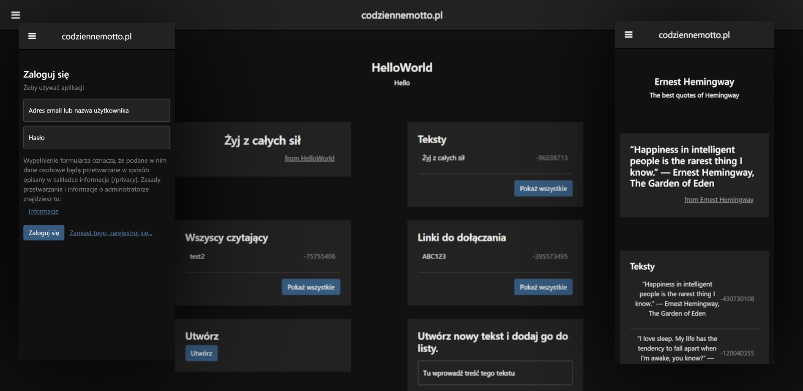

# CodzienneMotto.pl
Responsive Cross-Platform Application for codziennemotto.pl

**CodzienneMotto.pl** allows you to create a lists of daily quotes, invite users to join your list and schedule quote to specific day
<bR>
I made with ❤ in Mithril and TypeScript.



## Installation


```shell
# Clone the repo and change current working directory.
git clone https://www.github.com/kacperfaber/codziennemotto-pl-app && cd codziennemotto-pl-app
```

#### Setup the app
```shell
# Install dependencies
npm install

# Will download all assets
npm run setup
```

#### Run locally using serve

```shell
# Will use webpack.config.dev.js and run app as developer.
npm run run-dev
```

## Configuration
The app actually uses only two configuration values
* **Profile** - When it's developer, we have some developer tools active.
* **ApiUrl** - URL when codziennemotto.pl API running. See [api](https://www.github.com/kacperfaber/codziennemotto_pl_server)

```js
// I'm using webpack-define-plugin to put this configuration variables into build.
// If you want to edit this, please see webpack.config.{profile}.js
// where {profile} is your active profile.
// for exmaple 'npm run run-dev' will work as developer.

new webpack.DefinePlugin({
    "process.env.PROFILE": JSON.stringify("dev"),
    "process.env.CONFIG": JSON.stringify({apiUrl: "http://localhost:8080"})
})
```

## Author
Kacper Faber
